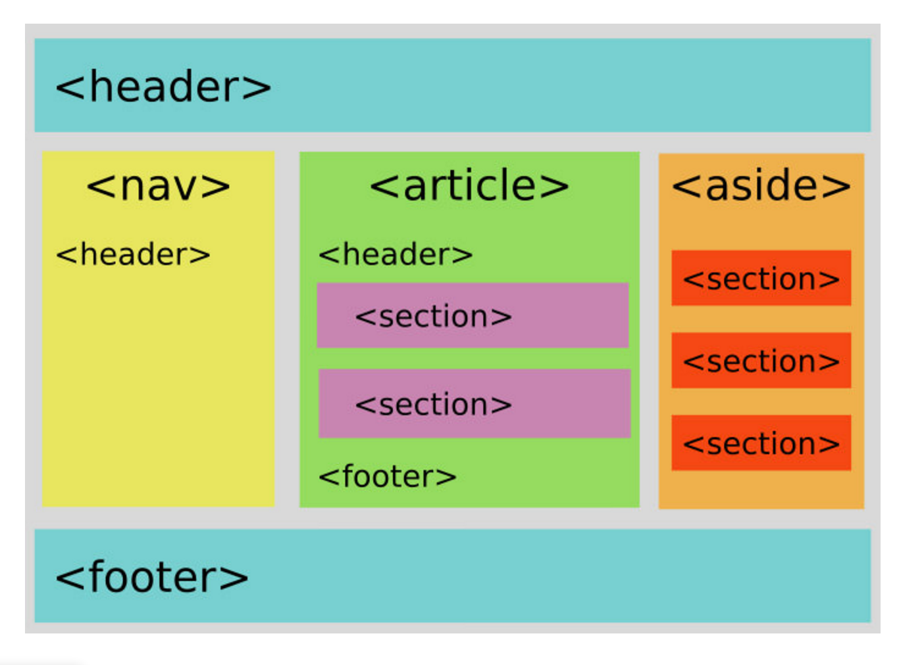
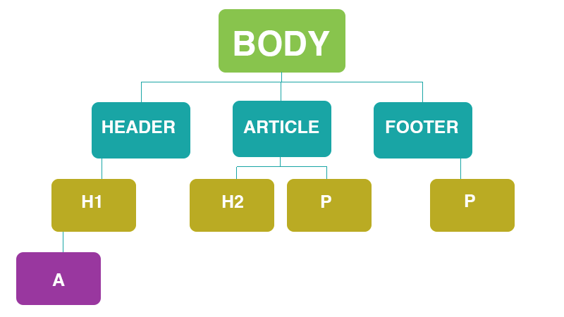

# Sectioning Elements

<iframe src="https://adaacademy.hosted.panopto.com/Panopto/Pages/Embed.aspx?pid=16809b8f-c1a0-41d2-be36-ac4b0170e4e8&autoplay=false&offerviewer=true&showtitle=true&showbrand=false&start=0&interactivity=all" height="405" width="720" style="border: 1px solid #464646;" allowfullscreen allow="autoplay"></iframe>

## 📚 Learning Goals 📚

By the end of this lesson we should be able to...

- Organize content using semantic sectioning tags
- Explain why we organize content with semantic sectioning tags

## What are Sectioning Elements
HTML has sectioning elements that allow you to organize your HTML document into logical topical sections.

The pattern of using HTML that describes its content or purpose are called *semantic HTML*. This is opposed to using HTML whose tags or organization do not reflect its content but reflect its presentation. Semantic HTML brings a big advantage for people and programs who need the structure to help them understand the page. These populations include people who use [screen readers](http://webaim.org/techniques/screenreader/) or bots who read through your website.


Below are tags that group elements together.

```html
  <body></body>

  <div></div>

  <section></section>

  <article></article>

  <nav></nav>

  <aside></aside>

  <header></header>

  <footer></footer>

  <main></main>
```

**Think, Pair, Share**

Take some time to research how to use each of the above tags. Then discuss with your neighbor(s). And then high five each other.

A good way to search for these tags is to type into Google:  `MDN <ELEMENT> tag`, for example `MDN aside tag`.  This way you will get the Mozilla Developer Network as your 1st result.

## Organize Content with Sectioning Elements

Sectioning elements wrap around the elements we have already been working with. Organizing elements into sectioning elements will also become useful as we start to style the layout of our webpages.

Here are a couple of diagrams of how these sectioning elements might be laid out on a webpage.   




## Element Relationships

When elements become nested inside of each other they start to form relationships.
- An element that is inside of another is a _child_ element
- The element wrapping a child is its _parent_
- Elements on the same level as each other are _sibling_ elements

A visual diagram of elements relationships to each other:


The relationship tree above is modeled from the following code:

```html
<body>
  <header>
    <h1><a href="index.html">Meowspace</a></h1>
  </header>
  <article>
    <h2>You're Meowsome</h2>
    <p>
      Soft kitty warm kitty little ball of furr but hide when guests come over, for gnaw the corn cob purr for no reason. Lies down knock over christmas tree but kitty ipsum dolor sit amet, shed everywhere shed everywhere stretching attack your ankles chase the red dot, hairball run catnip eat the grass sniff or massacre a bird in the living room and then look like the cutest and most innocent animal on the planet, and hide head under blanket so no one can see. Kitty power!
    </p>
  </article>
  <footer>
    <p>&copy; 2016</p>
  </footer>
</body>
```


### Draw a relationship tree for the HTML code below:

```html
  <body>

    <header>
      <h1>Meowspace</h1>
      <nav>
         <ul>
            <li><a href="#">Login</a></li>
            <li><a href="#">Signup</a></li>
         </ul>
      </nav>
    </header>
    <main>
      <section>
        <h2>Articles</h2>
        <article>
          <header>
            <h3>Everybody Wants to be a Cat</h3>
            <p>By: Tiger</p>
          </header>
          <p>
            Leave hair everywhere. Wake up wander around the house making large amounts of noise jump on top of your human's bed and fall asleep again poop in the plant pot all of a sudden cat goes crazy, so pee in the shoe. Cat is love, cat is life eat owner's food human is washing you why halp oh the horror flee scratch hiss bite or paw at your fat belly.
          </p>
          <p>
            This human feeds me, i should be a god love to play with owner's hair tie. Kitty power! see owner, run in terror all of a sudden cat goes crazy. Attack feet russian blue so intently sniff hand. Leave hair everywhere. Wake up wander around the house making large amounts of noise jump on top of your human's bed and fall asleep again poop in the plant pot. Destroy couch as revenge.
          </p>
        </article>
        <article>
          <header>
            <h3>Everybody Wants to be a Cat</h3>
            <p>By: Felix</p>
          </header>
          <p>
            Kitty power! see owner, run in terror all of a sudden cat goes crazy. Attack feet russian blue so intently sniff hand.
          </p>
          <p>
            Cat is love, cat is life eat owner's food human is washing you why halp oh the horror flee scratch hiss bite or paw at your fat belly.
          </p>
        </article>
      </section>
    </main>

    <footer>
      <ul>
        <li><a href="#">Contact</a></li>
        <li><a href="#">Careers</a></li>
      </ul>
    </footer>

 </body>
```

<!-- >>>>>>>>>>>>>>>>>>>>>> BEGIN CHALLENGE >>>>>>>>>>>>>>>>>>>>>> -->
<!-- Replace everything in square brackets [] and remove brackets  -->

### !challenge

* type: multiple-choice
* id: 9cc12488-0a97-459a-a1c3-66139e5849df
* title: Relationships
* points: 1
* topics: html

##### !question

```html
<footer>
  <ul>
    <li><a href="#">Contact</a></li>
    <li><a href="#">Careers</a></li>
  </ul>
</footer>
```

Looking at the above snippet of code from the example, the `ul` element is the ___ of the `li` elements.

##### !end-question

##### !options

* Child
* Parent
* Sibling
* Unrelated element

##### !end-options

##### !answer

* Parent

##### !end-answer

<!-- other optional sections -->
<!-- !hint - !end-hint (markdown, users can see after a failed attempt) -->
<!-- !rubric - !end-rubric (markdown, instructors can see while scoring a checkpoint) -->
<!-- !explanation - !end-explanation (markdown, students can see after answering correctly) -->

### !end-challenge

<!-- ======================= END CHALLENGE ======================= -->

<!-- >>>>>>>>>>>>>>>>>>>>>> BEGIN CHALLENGE >>>>>>>>>>>>>>>>>>>>>> -->
<!-- Replace everything in square brackets [] and remove brackets  -->

### !challenge

* type: multiple-choice
* id: a61b694d-93ae-48d9-b507-80c60a527b85
* title: Relationships
* points: 1
* topics: html

##### !question

```html
<footer>
  <ul>
    <li><a href="#">Contact</a></li>
    <li><a href="#">Careers</a></li>
  </ul>
</footer>
```

Looking at the above snippet of code from the example, the `ul` element is a ___ of the `footer` element.

##### !end-question

##### !options

* Child
* Parent
* Sibling
* Unrelated element

##### !end-options

##### !answer

* Child

##### !end-answer

<!-- other optional sections -->
<!-- !hint - !end-hint (markdown, users can see after a failed attempt) -->
<!-- !rubric - !end-rubric (markdown, instructors can see while scoring a checkpoint) -->
<!-- !explanation - !end-explanation (markdown, students can see after answering correctly) -->

### !end-challenge

<!-- ======================= END CHALLENGE ======================= -->

<!-- ======================= END CHALLENGE ======================= -->

<!-- >>>>>>>>>>>>>>>>>>>>>> BEGIN CHALLENGE >>>>>>>>>>>>>>>>>>>>>> -->
<!-- Replace everything in square brackets [] and remove brackets  -->

### !challenge

* type: multiple-choice
* id: 5eee9c42-a3e3-4954-a378-4c624ec2ba27
* title: Relationships
* points: 1
* topics: html

##### !question

```html
<footer>
  <ul>
    <li><a href="#">Contact</a></li>
    <li><a href="#">Careers</a></li>
  </ul>
</footer>
```

Looking at the above snippet of code from the example, the two `a` or anchor tags are _____ to each other

##### !end-question

##### !options

* Child
* Parent
* Sibling
* Unrelated elements

##### !end-options

##### !answer

* Unrelated elements

##### !end-answer

<!-- other optional sections -->
<!-- !hint - !end-hint (markdown, users can see after a failed attempt) -->
<!-- !rubric - !end-rubric (markdown, instructors can see while scoring a checkpoint) -->
##### !explanation 

The two elements **do not** share the same parent, so they are unrelated in this context, even though they share the same grandparent.

##### !end-explanation

### !end-challenge

<!-- ======================= END CHALLENGE ======================= -->


## Vocab ✅

  - Semantic
  - Sectioning
  - Parent
  - Child
  - Sibling

## Key Takeaway 

Sectioning elements can be used to provide *semantic meaning* to the content they enclose.  Using the approprate sectioning element is important to provide clues for screen reading applications and to other developers reading your code.  When an HTML element encloses another tag it becomes that tag's *parent*.  The enclosed tag is called the *child element*.  When two elements share the same parent they are called *siblings*.  You can draw this type of relationship as a tree structure.

### Additional Resources

- [Treehouse Blog Post](http://blog.teamtreehouse.com/use-html5-sectioning-elements) (freely available)
- [Element Relationships](http://www.littlewebhut.com/css/info_element_relationships/)
- [A Look Into Proper HTML5 Semantics](http://www.hongkiat.com/blog/html-5-semantics/)
