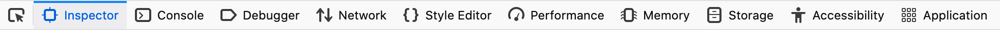
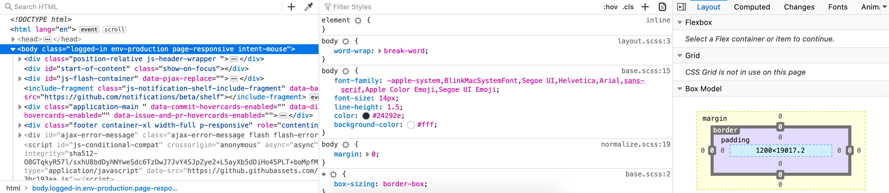

# Developer Tools & Default Styles

## Learning Goals 📚

- Use developer tools to identify default styles of elements
- Use developer tools to identify inherited styles of elements

## Video Demos

<iframe src="https://adaacademy.hosted.panopto.com/Panopto/Pages/Embed.aspx?pid=80c57354-a252-4c5e-812a-ac530001be05&autoplay=false&offerviewer=true&showtitle=true&showbrand=false&start=0&interactivity=all" height="405" width="720" style="border: 1px solid #464646;" allowfullscreen allow="autoplay"></iframe>

## What are Developer Tools?

The Firefox Developer Tools (Dev Tools for short), are a set of web authoring and debugging tools built into Firefox. The Dev Tools provide web developers deep access into the internals of the browser and their web application.

Other Browsers, such as Chrome and Safari, have their own debugging developer tools. They are worth becoming familiar with as you begin to be aware of cross-browser compatibility. Because we are only developing with Firefox this week, we are going to focus specifically on Firefox's Developer Tools.

## Dive into Developer Tools!

Now that we've gotten deeper into HTML and CSS, let's explore more fully what Dev Tools can show us.

Reminder: you can open Dev Tools in Chrome with any of the following methods:
- right click on a page and click on 'Inspect' from the menu
- use the keyboard shortcut `cmd + opt + i`
- in Firefox on the top right, click the [hamburger button](https://en.wikipedia.org/wiki/Hamburger_button), and look near the bottom of the list for "Web Developer". Clicking this option will give you a list of specific tools you can select. 

To start, click on the *Inspector* tab. You should get something that looks like this:

It should show you some HTML code of the page you are on in one panel, CSS in another panel, and some visualizations an other options on the final panel. This HTML code is reflecting your site's DOM.

### Your Site's What?
Your site's DOM! The Document Object Model (DOM for short) is a cross-platform and language-independent interface that treats an HTML document as a tree structure wherein each node is an object representing a part of the document.

In other words, your html gets turned into a tree where each tag is a node so that the browser has an easier time finding, displaying, and styling individual elements. We call that tree the DOM.

### Look at Element's Default Styles
In the HTML code panel, click on an element (a node of our DOM tree). The CSS panel should change to reflect the styles that are affecting that specific element.

The are various sources of CSS that are affecting that element.

## Vocab ✅
- DOM (Document Object Model)

## 🔑 Key Takeaway
Using Chrome's Dev tools should be a primary front-end debugging tool.

### Additional Resources
[DevTools Documentation](https://developers.google.com/web/tools/chrome-devtools/iterate/inspect-styles/?utm_source=dcc&utm_medium=redirect&utm_campaign=2016q3)
