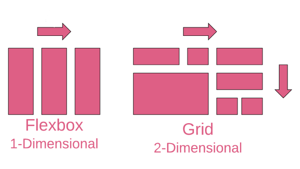
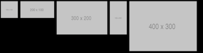
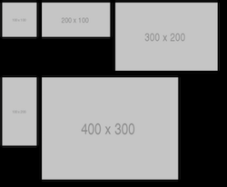
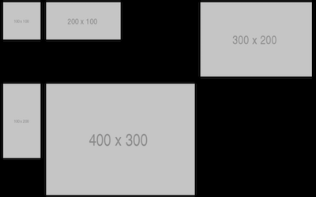
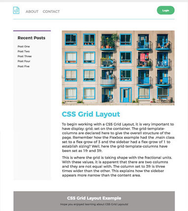
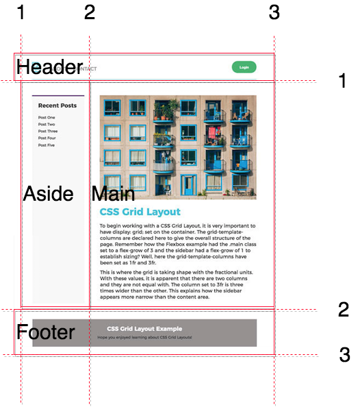

# Flexbox vs CSS Grid

## Learning Goals

- Understand the strengths of both Flexbox & CSS Grid
- Be able to decide when to use Flexbox or CSS Grid to solve layout issues

## Flexbox & Grid 1-D & 2-D Layout



### Flexbox Lays Content Out in One Dimension

All content in flexbox _flows_ horizontally or vertically inside a container.

Consider the following HTML & CSS:

**HTML:**
```html
<header>
  <div>
    
  </div>
  <div>
    
  </div>
  <div>
    
  </div>
  <div>
    
  </div>
  <div>
    
  </div>
</header>
```  

**CSS:**
```css
header {
  display: flex;
  flex-flow: row wrap;
}
img {
  margin: .5em;
}
```

Flexbox causes the images will line up in the available space left-to-right.  When the screen runs out of space elements will flow to the next line.   In this way Flexbox is _responsive_, the items wrap as needed to fit the available space.  

On a wide screen:



On a narrower screen:



You can of course cause Flexbox to lay content out in any direction, left-to-right, right-to-left, top-to-bottom, or bottom-to-top by changing the `flex-direction`.

**However** you cannot align the content in 2-Dimensions.  **Flexbox is 1-Dimensional**.  Content only flows along one axis, wrapping as needed.   

### Grid Lays Content Out In A... Grid

Using CSS Grid we can lay the same HTML in two dimensions this way:

```css
header {
  display: grid;
  grid-template-columns: repeat(3, 1fr);
}
img {
  margin: .5em;
}
* {
  background-color: black;
}
```



The content is organized into both rows and columns.  The grid generates as many 3-column rows as needed to contain the content.  We see gaps where content does not fill an entire cell, and with only 5 images, the bottom row contains an empty cell.  

With Flexbox the layout responds to the content, whereas with Grid the content responds to the layout.  It is often said that _Flexbox works from the flex-items out_ whereas _Grid works from the layout in_.

### Flexbox Adjusts Automatically To Screen width

Because Flexbox adjusts to the content the layout will respond automatically if you narrow the browser window adjusting the number of items in each row to allow them to fit.  

By contrast, Grid example above will always maintain 3 columns.  There are ways to adjust the number of columns for smaller screens, by using something like: `repeat(auto-fill, minmax(400px, 1fr));` which will generate as many columns as needed with a minimum size of 400 pixels and a maximum of 1 fraction of the row.  

```css
header {
  display: grid;
  grid-template-columns: repeat(auto-fill, minmax(400px, 1fr));
}
img {
  margin: .5em;
}
* {
  background-color: black;
}
```

You can see a working solution [in Codepen](https://codepen.io/adadev/pen/oqbqpY?editors=1100)

This example makes as many columns as will both fit and required with a minimum size for a column of `200px` and a maximum column size of `1fr`.

So Flexbox always responds to smaller screen sizes, while Grid can be configured in a responsive manner.   

**Exercise**: Try to update the [Codepen](https://codepen.io/adadev/pen/QmymaJ?editors=1100) of the Grid layout to make it responsive for smaller screens.  

You can find a solution [here](https://codepen.io/adadev/pen/VXeXQp).

## Grid and Flexbox Work Well **Together**

Consider the following site:



How would you lay out this content?  One common approach is to lay out the larger page with a grid, and then lay out smaller sections with Flexbox.

The grid could look like this:



**Exercise:** Take a look at the above grid and try to recreate the basic grid design with a header at the top aside on the left and main on the right with a footer crossing the bottom in [this codepen](https://codepen.io/adadev/pen/MVKVQd?editors=1100).  Only the container elements are listed with and background colors are added to make the elements easier to see.

You can find a solution [here](https://codepen.io/adadev/pen/XEXEEJ?editors=1100).

Then Flexbox could lay out individual elements like:


Of course you could also lay out the subregions of the site with Grid as well, but if content is only along one axis, Flexbox usually requires less work.  

**Question** How could you lay out the header with Flexbox so the button is on the right?  You can practice with a codepen [here](https://codepen.io/adadev/pen/aYZdYp).

## So do I use Flexbox or Grid?

<!-- >>>>>>>>>>>>>>>>>>>>>> BEGIN CHALLENGE >>>>>>>>>>>>>>>>>>>>>> -->
<!-- Replace everything in square brackets [] and remove brackets  -->

### !challenge

* type: multiple-choice
* id: 71c947dd-4ac0-4d5d-93a6-ec3a89bad265
* title: Flexbox or Grid Q1
* points: 1
* topics: css-grid, flexbox

##### !question

If I only need to lay content out by row **or** by column I should use ____.

##### !end-question

##### !options

* Flexbox
* Grid

##### !end-options

##### !answer

* Flexbox
  
##### !end-answer

<!-- other optional sections -->
<!-- !hint - !end-hint (markdown, users can see after a failed attempt) -->
<!-- !rubric - !end-rubric (markdown, instructors can see while scoring a checkpoint) -->
##### !explanation

Flexbox works in only one direction, so it can work well in that case.

##### !end-explanation

### !end-challenge

<!-- ======================= END CHALLENGE ======================= -->

<!-- >>>>>>>>>>>>>>>>>>>>>> BEGIN CHALLENGE >>>>>>>>>>>>>>>>>>>>>> -->
<!-- Replace everything in square brackets [] and remove brackets  -->

### !challenge

* type: multiple-choice
* id: 6a0384ce-3239-4458-8a80-53d53fdd6b28
* title: Flexbox or Grid Q2
* points: 1
* topics: css-grid, flexbox

##### !question

If I need to control layout with both row **and** column I should use _____

##### !end-question

##### !options

* Flexbox
* Grid

##### !end-options

##### !answer

* Grid

##### !end-answer

<!-- other optional sections -->
<!-- !hint - !end-hint (markdown, users can see after a failed attempt) -->
<!-- !rubric - !end-rubric (markdown, instructors can see while scoring a checkpoint) -->
##### !explanation

Grid works in 2 dimensions

##### !end-explanation

### !end-challenge

<!-- ======================= END CHALLENGE ======================= -->

<!-- >>>>>>>>>>>>>>>>>>>>>> BEGIN CHALLENGE >>>>>>>>>>>>>>>>>>>>>> -->
<!-- Replace everything in square brackets [] and remove brackets  -->

### !challenge

* type: multiple-choice
* id: 5c97901d-939e-4281-aaaf-455f92de930c
* title: Flexbox or Grid Q3
* points: 1
* topics: css-grid, flexbox

##### !question

If it is important that items "line up" horizontally and vertically with each other I should use _____

##### !end-question

##### !options

* Flexbox
* Grid

##### !end-options

##### !answer

* Grid

##### !end-answer

<!-- other optional sections -->
<!-- !hint - !end-hint (markdown, users can see after a failed attempt) -->
<!-- !rubric - !end-rubric (markdown, instructors can see while scoring a checkpoint) -->
##### !explanation

Grid works in 2 dimensions so to line things up both vertically and horizontally requires grid.

##### !end-explanation

### !end-challenge

<!-- ======================= END CHALLENGE ======================= -->


## Conclusions

1.  CSS Grids are great for defining the larger picture and organizing the whole page or section layout.
1.  Flexbox is good for aligning elements within containers.  Use flex for smaller elements of design.
1.  CSS Grid is great for 2D layouts with rows & columns.
1.  Flexbox is for 1-Dimensional layouts (vertical or horizontal).
1.  They work very well **together**.

# Resources

- [MDN Grid & Flexbox](https://developer.mozilla.org/en-US/docs/Web/CSS/CSS_Grid_Layout/Relationship_of_Grid_Layout)
- [The ultimate CSS battle: Grid vs Flexbox](https://hackernoon.com/the-ultimate-css-battle-grid-vs-flexbox-d40da0449faf)
- [Does CSS Grid Replace Flexbox?](https://css-tricks.com/css-grid-replace-flexbox/)
- [Should I use Grid or Flexbox?](https://rachelandrew.co.uk/archives/2016/03/30/should-i-use-grid-or-flexbox/)
- [Layout Land:  Flexbox vs CSS Grid - Video](https://www.youtube.com/watch?v=hs3piaN4b5I)